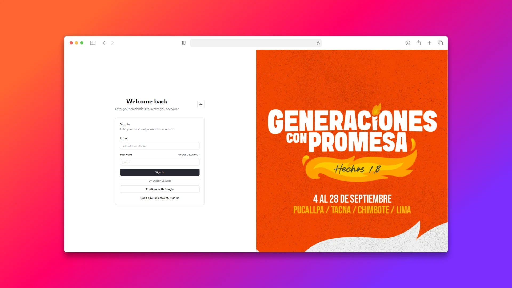

# 🎉 Sistema de Gestión de Eventos y Administración de Participantes



Una aplicación web moderna para la **creación de eventos**, administración de participantes y seguimiento de productos o actividades asignadas a cada persona. Además, permite realizar pagos en **cuotas o plazos**, con control de vencimientos y estados.

## 🚀 Tecnologías Utilizadas

- **React** – Biblioteca principal para la UI.
- **TypeScript** – Tipado estático para mayor seguridad.
- **React Router** – Manejo de rutas dinámicas y protegidas.
- **Zustand** – Gestión de estado global.
- **JWT (JSON Web Token)** – Autenticación y autorización segura.
- **React Hook Form + Yup** – Formularios con validación.
- **ShadCN** – Componentes UI modernos, accesibles y reutilizables.
- **TailwindCSS** – Estilado rápido y responsivo.
- **React Toastify** – Notificaciones amigables para el usuario.

## ✨ Funcionalidades Principales

- 📆 Crear y editar eventos personalizados.
- 👥 Registrar y administrar asistentes por evento.
- 🎁 Asignar productos o actividades por participante.
- 💰 Permitir pagos en cuotas, con seguimiento de estado y fechas.
- 🔐 Acceso autenticado con JWT y rutas protegidas.
- 🔄 Estado persistente usando Zustand.
- ✅ Formularios validados y accesibles.
- 📲 UI moderna, responsiva y accesible.

## 📸 Capturas

(Agrega aquí imágenes del proyecto si lo subes a GitHub)

## 🛠 Instalación y ejecución

1. **Clona el repositorio**
   ```bash
   git clone https://github.com/tu-usuario/tu-repo.git
   cd tu-repo

npm install

VITE_API_URL=http://localhost:3000/api
VITE_JWT_SECRET=tu_secreto

npm run dev

### Accede desde 
http://localhost:5173